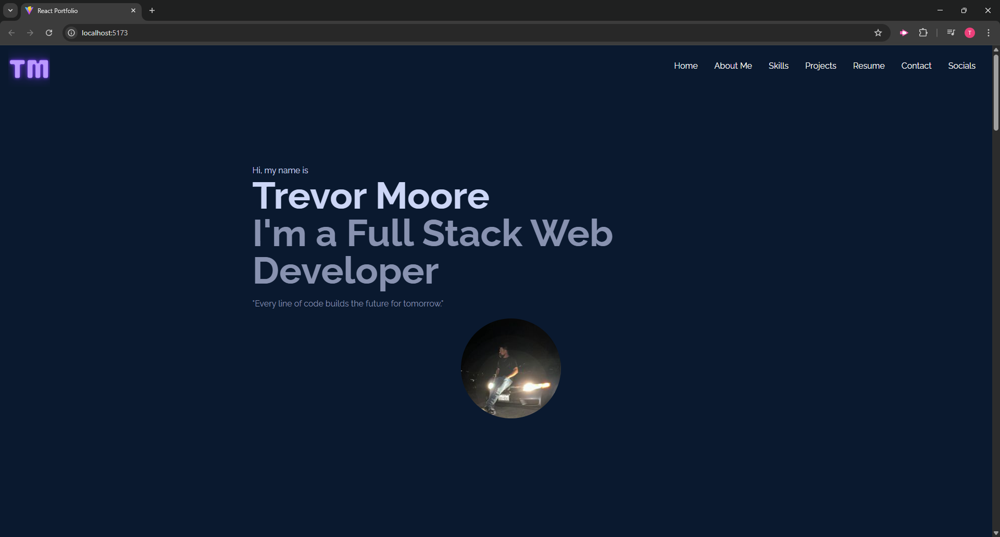
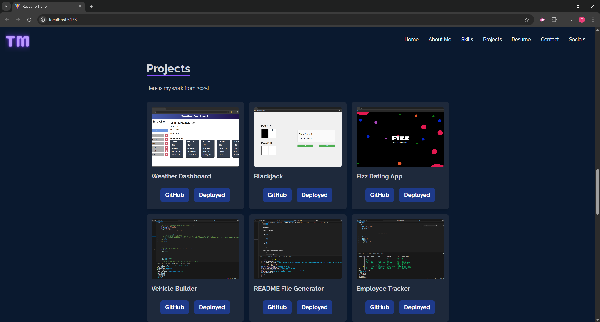

# React Portfolio

  

  ## Description
  This portfolio application demonstrates your ability to build a dynamic, single-page React application. It features multiple sections including a Home, About Me, Skills, Projects, Resume, Contact, and Socials all accessible through an interactive header navigation. Each section is crafted to highlight your skills, projects, and professional information effectively.

  ## Table of Contents
  - [Installation](#installation)
  - [Usage](#usage)
  - [Technologies](#technologies)
  - [Screenshots](#screenshots)
  - [Walkthrough Video](#walkthrough-video)
  - [URL Link](#url-link)
  - [Contributing](#contributing)
  - [Contributors](#contributors)
  - [Tests](#tests)
  - [License](#license)
  - [Questions](#questions)

  ## Installation
  
  1. Git clone: git@github.com:Treevyy/React-Portfolio.git

  2. Navigate to the project directory: cd React-Portfolio

  3. Right click the root package.json file and click open in integrated terminal

  4. Inside the terminal install the dependencies with the command: npm i

  5. After dependencies are installed run the application with the command: npm run build

  6. After your build is done run the application with the command: npm run dev

  ## Usage
  
  The application is designed as a single-page React portfolio that displays the following sections:

  Home - 
  Provides a welcome or introductory message to visitors.

  About Me - 
  Offers a detailed overview of your background, including your photo and a brief bio.

  Skills - 
  Lists your technical proficiencies and areas of expertise.

  Projects - 
  Showcases your portfolio projects with images, descriptions, and links to both deployed applications and their GitHub repositories.

  Resume - 
  Includes a downloadable version of your resume and highlights your professional experience.

  Contact - 
  Features a contact form that allows visitors to send inquiries, along with your displayed contact details.

  Socials - 
  Displays links to your social media profiles (e.g., GitHub, LinkedIn, and additional future platforms will be added).

  ## Technologies
 

 

 

 

 

 

 

 

  ## Screenshots
  
  

  
  
  ## Walkthrough Video
  A demo of the application can be found at the following link: https://drive.google.com/file/d/1GqMhBX4deKtlteTndQvIzUg9wEEVy0qW/view

  ## URL Link
   Here is the URL link to the deployed application: 
   https://magnificent-cupcake-a4ea02.netlify.app/
  
  ## Contributing
  No contributions are needed for this project

  ## Contributors
  All of these TA's and tutors helped me revise and edit my code to function properly during office hours and through tutoring sessions. Thank you for all your help!

  1. Trevor Moore aka Treevyy

  2. Charlie Puente - TA

  3. Quentin Jones - TA

  4. Chris - Tutor

  5. Erik - Tutor

  6. Ainsley - Tutor

  ## Tests
  npm run dev inside the terminal to test on localhost

  ## License
  
  This project is licensed under the MIT license.

  ## Questions
  If you have any additonal questions, you can contact me at:
  - GitHub: [Treevyy](https://github.com/Treevyy)
  - Email: [aarontrevormoore@gmail.com](mailto:aarontrevormoore@gmail.com)
